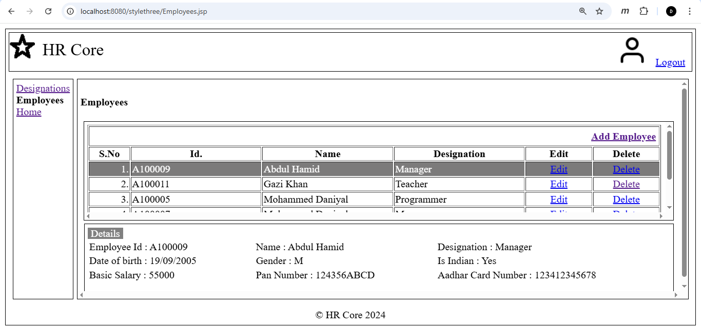
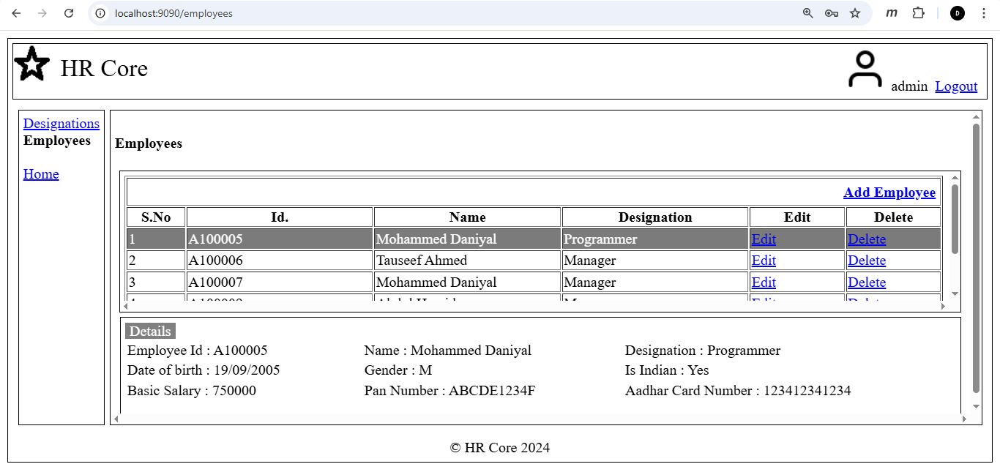
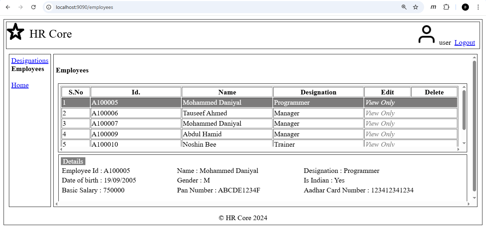

# HR Core: The Evolution of Web Architecture

This repository contains the same Human Resources CRUD domain implemented **four different times**, each using a progressively modern architectural approach.

The purpose of this project is not merely to build a CRUD application, but to analyze how web architectures evolved, the limitations each stage exposed, and how subsequent patterns addressed those constraints.

---

## Domain Scope

The HR domain is intentionally minimal (Employees and Designations) to isolate architectural changes without introducing feature-driven complexity.
The business rules remain constant across all stages to ensure a controlled comparison.

---

## Architectural Comparison

| Stage                           | Pattern                 | What changes                                                        | Why it matters                                                                                        |
| :------------------------------ | :---------------------- | :------------------------------------------------------------------ | :---------------------------------------------------------------------------------------------------- |
| **[01](./stage-1-servlet/)**    | Imperative Servlet      | HTML manually generated via `PrintWriter`                           | Exposes tight coupling between presentation and server logic, and the verbosity of raw HTTP handling. |
| **[02](./stage-2-jsp-mvc/)**    | MVC (JSP + Custom Tags) | View separated from controller logic                                | Introduces structured separation of concerns and server-side access control.                          |
| **[03](./stage-3-ajax-json/)**  | AJAX + JSON             | Browser renders UI; server returns data                             | Demonstrates stateless request handling and client-driven rendering.                                  |
| **[04](./stage-4-springboot/)** | Spring Boot SPA         | REST controllers, JPA persistence, and role-based endpoint security | Represents a modern decoupled architecture with structured validation and centralized security.       |

---

## Consistent Design, Evolving Engine

The visual design, database schema, and domain constraints remain consistent across all stages. What evolves is the **mechanism of rendering, state management, and security enforcement**.

* **Stages 1–3:** UI is server-driven, progressively decoupled but still session-oriented.
* **Stage 4:** UI becomes fully client-driven (SPA). Rendering responsibility shifts to the browser, while authorization enforcement remains strictly server-side.

### Stage 4: RBAC in Action

|      Admin View (Full Access)      |  Standard User View (Read-Only)  |
| :--------------------------------: | :------------------------------: |
|  |  |

Role-Based Access Control (RBAC) is enforced at the REST endpoint level using Spring Security.
The SPA adapts dynamically to the authenticated user's role, modifying the interface while backend authorization remains authoritative.

---

## Evolution of Security & State

This project also tracks how authentication and session handling mature across stages:

* **Stage 1 – No Security:** Completely open access; no authentication or session management.
* **Stages 2 & 3 – Manual Session Management:** Authentication implemented using `HttpSession`, with explicit access checks in controllers or interceptors.
* **Stage 4 – Spring Security:** Authentication and authorization delegated to Spring Security. Session management is framework-controlled via HttpOnly `JSESSIONID` cookies, with role-based protection applied at the endpoint level.

---

## Purpose

Built as a portfolio case study to demonstrate:

* Architectural progression across eras of web development
* Separation of concerns and decoupling strategies
* Validation and domain constraint enforcement
* Session and security evolution
* Refactoring discipline while preserving domain consistency
