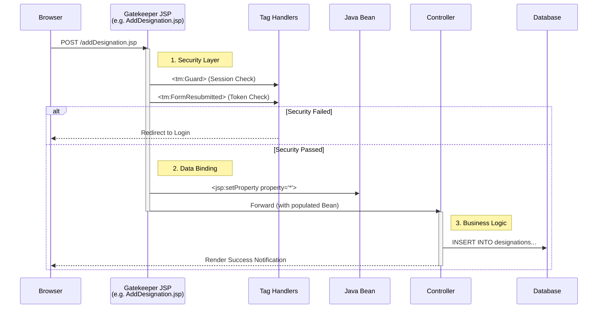

# Stage 2: JSP & Custom Tag Architecture

> **Architecture:** MVC (Model 2) with "Intercepting Filter" Pattern
> **Rendering:** JSP with Reflection-based Custom Tags
> **Tooling:** Custom Tag Library (TLD) & Tag Handlers

## Concept
In Stage 1, I generated HTML using a CLI tool. In Stage 2, I adopted **JSP** to separate the View from the Logic.

However, standard JSP allows "Scriptlets" (Java code inside HTML). To prevent this and enforce strict separation, I built a **Custom Tag Engine** that handles iteration, logic, and security declaratively. The JSP files contain **zero Java code**, only custom `<tm:tag>` elements.

## Request Flow: The "JSP Gatekeeper"
Unlike standard MVC where requests go directly to a Servlet, this architecture uses specific JSP files (e.g., `AddDesignation.jsp`) as **Security Gates** before the request reaches the Controller.

**Case Study: Adding a Record**
1.  **Input:** Form submits to `AddDesignation.jsp`.
2.  **Filter:** Custom tags validate Session (`Guard`) and CSRF Tokens (`FormResubmitted`).
3.  **Binding:** The JSP populates the Java Bean.
4.  **Forward:** Only valid requests reach the Servlet.



## The Problem: "Scriptlet Hell"

Standard JSP encourages mixing business logic with UI logic. This makes the codebase fragile; a frontend designer deleting a closing bracket `}` can crash the server.

*Goal:* I wanted the JSP to look like pure HTML/XML, with no visible Java syntax.

## The Solution: A Reflection-Based Tag Engine

Instead of writing hardcoded loops, I implemented a generic tag library (`WEB-INF/tlds/mytags.tld`) that uses **Java Reflection** to inspect and manipulate data.

### 1. The Generic Iterator (`<tm:EntityList>`)

I built a single tag to handle *all* lists in the application (Employees, Designations, etc.).

* **Mechanism:** The tag accepts the class name and method name as strings.
* **Logic:** The Tag Handler uses `Class.forName(populatorClass)` and `method.invoke()` to fetch data dynamically.

*Usage in `Designations.jsp`:*

```jsp
<tm:EntityList 
    populatorClass='com.thinking.machines.hr.bl.DesignationBL' 
    populatorMethod='getAll' 
    name='cool'>
    
    <tr>
        <td>${serialNumber}</td>
        <td>${cool.title}</td>
    </tr>
</tm:EntityList>

```

### 2. Declarative Security (`<tm:Guard>` & `<tm:FormID>`)

I moved security logic out of the Servlet and into the View Layer to ensure it is never missed.

* **Synchronizer Token Pattern:** `<tm:FormID>` generates a token, and `<tm:FormResubmitted>` validates it. This prevents duplicate database insertions on page refresh.
* **Access Control:** `<tm:Guard>` is placed in the **Master Page** (`MasterPageTopSection.jsp`). This means *every* page that includes the header is automatically secured.

### 3. Composite View Pattern (Master Pages)

To adhere to DRY (Don't Repeat Yourself), I implemented a templating system.

* **Context Awareness:** The `<tm:Module>` tag sets the current "Active State" (e.g., HOME, EMPLOYEE).
* **Result:** The `MasterPageTopSection.jsp` reads this state to highlight the correct Sidebar link automatically.

---

## Architectural Analysis

| Dimension | Rating | Reason |
| --- | --- | --- |
| **Separation** | High | Zero Java code in `.jsp` files. Logic is hidden in Handlers. |
| **Security** | High | Declarative security reduces human error (hard to forget). |
| **Complexity** | High | Requires maintaining a complex TLD file and Reflection logic. |

---

## Evolution

While this architecture is clean and secure, it is strictly **Synchronous**.

* Every interaction (sorting, paging, deleting) requires a **Full Page Reload**.
* The server must render the entire HTML page for every request, which increases bandwidth usage.

To solve this, I moved to a **Stateless Architecture** using AJAX and JSON in the next stage.

**[Next: Stage 3 (AJAX & JSON Architecture)](../stage-3-ajax-json)**
