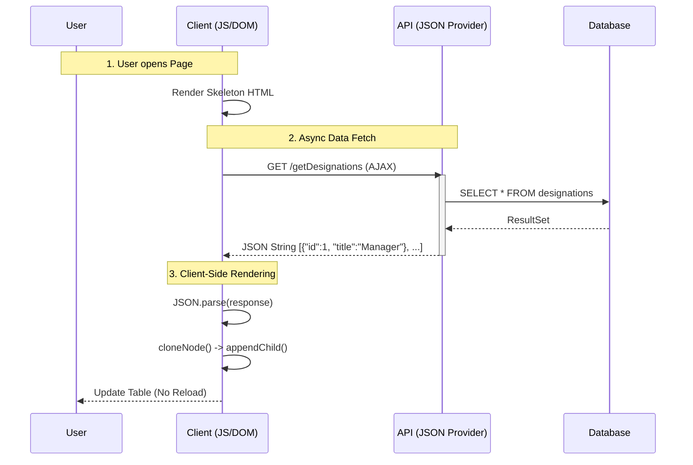

#  Stage 3: AJAX & Stateless Architecture

> **Architecture:** Stateless Client-Server Model (REST-like)
> **Rendering:** Client-Side Rendering (CSR) via Vanilla JavaScript
> **Key Innovation:** Decoupling Data (JSON) from Presentation (HTML) to eliminate page reloads.

## Concept
In Stage 2, every interaction required a full page reload because the server had to rebuild the entire HTML page.

In Stage 3, I moved to a **Stateless Architecture**. The Server now only sends raw data (**JSON**), and the Browser (Client) is responsible for building the UI dynamically. This reduces bandwidth usage and creates a smoother user experience.

##  Architecture: The JSON Data Loop
Instead of receiving HTML, the browser requests data and paints the screen itself.

### Request Flow (e.g., Loading Designations)
1.  **Initial Load:** Browser loads the skeleton HTML (Headers, empty Table).
2.  **Async Fetch:** JavaScript (`XMLHttpRequest`) calls the API endpoint.
3.  **JSON Response:** Server returns a lightweight JSON array.
4.  **DOM Painting:** JavaScript parses the JSON and updates the DOM in real-time.




##  Key Technical Implementation

### 1. Template-Based Rendering (The `cloneNode` Pattern)

Instead of messy string concatenation (e.g., `innerHTML += "<tr>" + name + "</tr>"`), I used a professional **DOM Templating** technique.

* **Strategy:** Keep a hidden "Template Row" in the HTML.
* **Execution:** JavaScript clones this row, populates the data, and appends it to the table.
* **Benefit:** Keeps the HTML clean and prevents XSS (Cross-Site Scripting) attacks associated with innerHTML.

*Code Snippet (`Designations.jsp`):*

```javascript
// 1. Get the template row
var templateRow = designationTableBody.getElementsByTagName("tr")[0];

// 2. Loop through JSON data
for(var i=0; i<designations.length; i++) {
    // 3. Clone the node (High Performance)
    var dynamicRow = templateRow.cloneNode(true);
    
    // 4. Inject Data
    dynamicRow.querySelector("[placeHolderId='designation']").innerHTML = designations[i].title;
    
    // 5. Append to Table
    designationTableBody.appendChild(dynamicRow);
}

```

### 2. The "Client-Side Guard"

Since the UI is rendered on the client, I moved the security check to the frontend as well (in addition to backend checks).

* **Logic:** On page load, `MasterPageTopSection.jsp` fires an AJAX request (`guard()`) to check if the session is valid.
* **Result:** If the API returns `{success: false}`, the JavaScript immediately redirects the user to the login page.

### 3. Raw `XMLHttpRequest` Implementation

I deliberately chose **not** to use `fetch` or `axios` libraries.

* **Why?** I wanted to understand the low-level **HTTP State Machine**.
* **Implementation:** I manually handle `readyState == 4` (Done) and `status == 200` (OK) to ensure robust error handling.

---

##  Architectural Analysis

| Dimension | Rating | Reason |
| --- | --- | --- |
| **User Experience** |  High | No page reloads; feels like a Desktop App (SPA). |
| **Bandwidth** |  High | Only transfers data (JSON), not repetitive HTML markup. |
| **SEO** |  Low | Search engines struggle to index content rendered by JavaScript (without SSR). |
| **Complexity** |  Medium | Requires managing state on both Client (JS) and Server (Java). |

---

##  Evolution

While AJAX solved the **User Experience** (no page reloads), the **Developer Experience** remained tedious.

* **Boilerplate Overload:** I am still manually mapping Database `ResultSet` to Objects (JDBC).
* **Manual Plumbing:** I have to write explicit code to convert Java Objects to JSON strings.
* **Configuration:** Setting up Servlets and Database connections requires repetitive code.

To solve this, I moved to **Spring Boot** in the next stage to automate the configuration and data access layers.

**[Next: Stage 4 (Spring Boot & Productivity)](../stage-4-springboot/)**